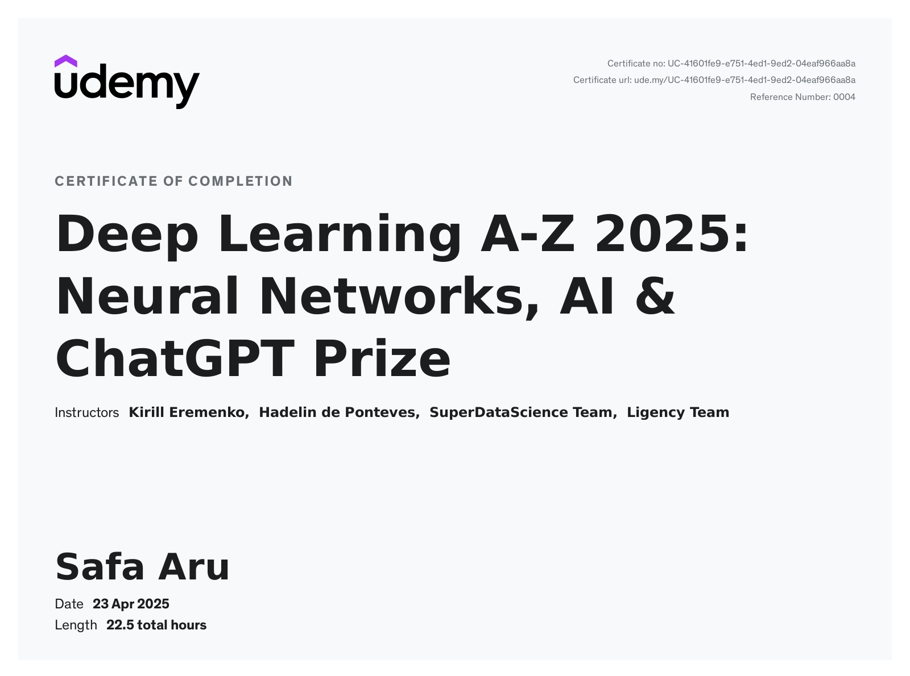

🧠 Deep Learning A-Z™ Certificate

    📚 Structured Curriculum: Covered both Supervised and Unsupervised Deep Learning through real-world projects and intuitive explanations.

    🔍 Hands-On with Real Projects: Built solutions for business challenges like customer churn prediction, fraud detection, image recognition, stock price forecasting, and movie recommendation systems.

    🧠 Algorithms Mastered: Gained practical experience with ANNs, CNNs, RNNs (LSTM), Self-Organizing Maps, Boltzmann Machines, and Stacked Autoencoders.

    ⚙️ Tool Proficiency: Used TensorFlow, PyTorch, Keras, Theano, Scikit-learn, NumPy, Pandas, and Matplotlib across projects.

    🚀 Industry-Relevant Training: Focused on applying cutting-edge Deep Learning models to real-world datasets with career-focused code blueprints and support.

    
